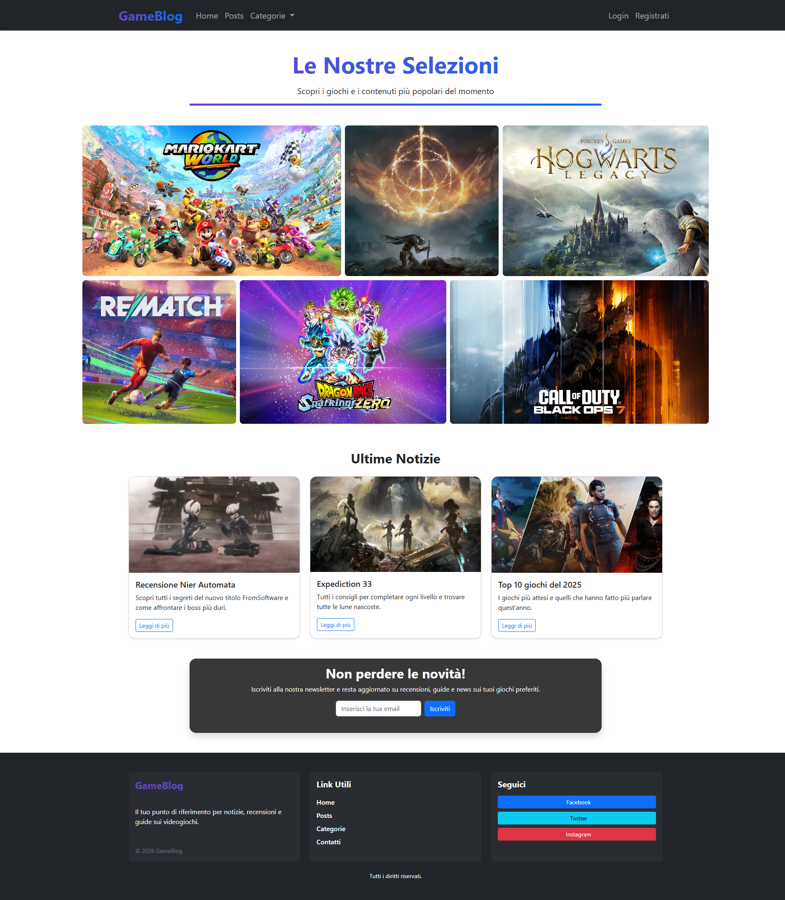
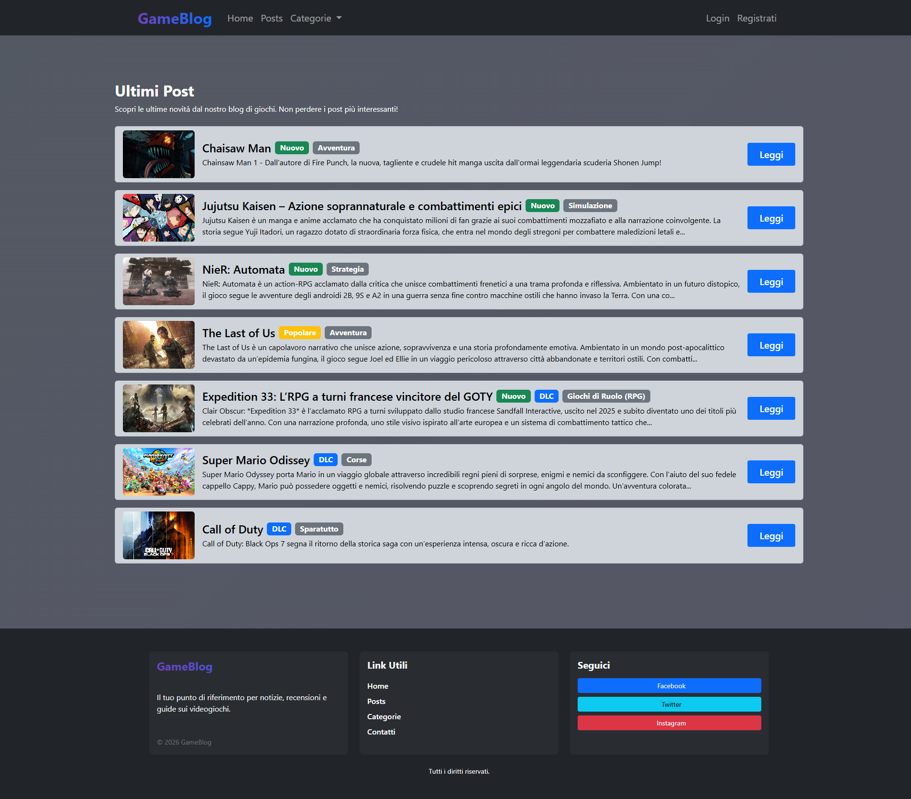
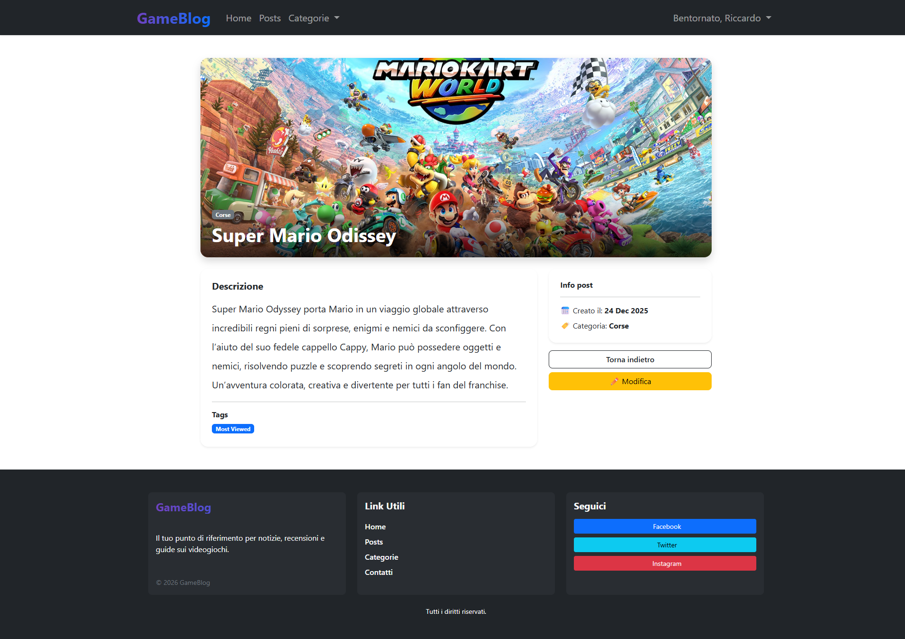
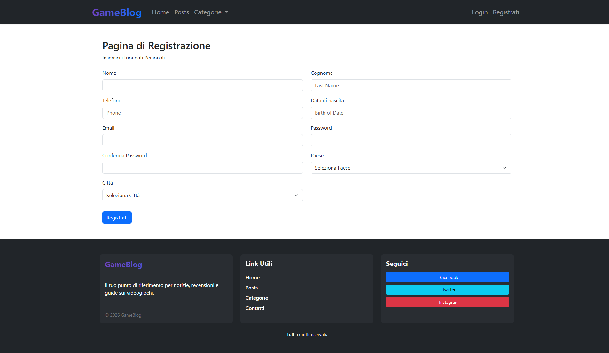

# Web-GameBlog

Piattaforma web per la scoperta e catalogazione di videogiochi,
realizzata con Laravel.

##  Funzionalità

- Registrazione e login utenti
- Lista completa dei giochi
- Dettaglio singolo gioco
- Sistema di categorie
- Interfaccia responsive con Bootstrap

## Immagini
- Homepage
  


- Posts



- Details
  


- Register
- 
  

##  Tech Stack

- **Backend:** PHP 8 · Laravel
- **Frontend:** Blade · Bootstrap 5 · JavaScript
- **Database:** MySQL

##  Installazione

```bash
git clone https://github.com/RiccardoLaRosa/Web-GameBlog.git
cd Web-GameBlog
composer install
cp .env.example .env
php artisan key:generate
php artisan migrate --seed
php artisan serve
```

##  Note

Le credenziali del database vanno configurate nel file `.env`.
