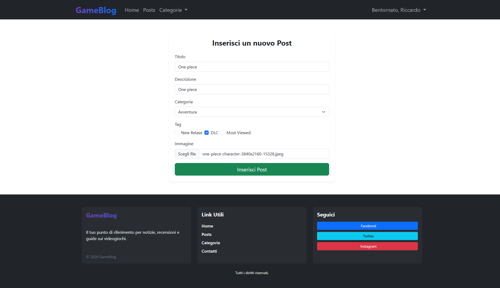

# 🎮 Web-GameBlog

Piattaforma web per la scoperta e catalogazione di videogiochi realizzata con Laravel.

---

## - Preview Homepage

  

---

## - Funzionalità

-  Login e registrazione utenti
-  Lista giochi
-  Dettaglio gioco
-  Categorie
-  Tags
-  Responsive UI

---

##  Tech Stack

- Laravel
- PHP 8
- MySQL
- Bootstrap 5

---

## Screens

  
  
  
  

---

## 🔗 Link

- GitHub Repo: https://github.com/RiccardoLaRosa/Web-GameBlog
